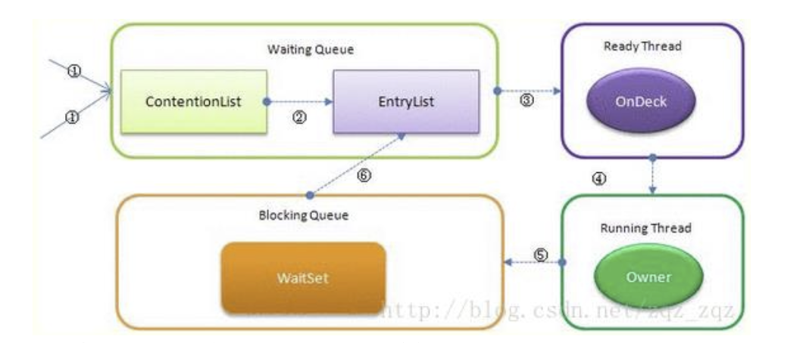

# synchronized 关键字

## synchronized

<!-- notecardId: 1735190387561 -->

### 说明

- `synchronized`关键字是 Java 中的一个同步机制，用于控制多个线程对共享资源的访问。它可以用来修饰方法或代码块，确保在同一时刻只有一个线程可以执行被修饰的代码，从而避免线程间的竞争和数据不一致的问题。
- `synchronized`关键字可以用来修饰方法或代码块，确保在同一时刻只有一个线程可以执行被修饰的代码。
- `synchronized` 它可以把任意一个非 NULL 的对象当作锁。他属于独占式的悲观锁，同时属于可重入锁。

### 作用范围

1. 作用于方法时，锁住的是对象的实例(this)；
2. 当作用于静态方法时，锁住的是 Class 实例，又因为 Class 的相关数据存储在永久带 PermGen
   （jdk1.8 则是 metaspace），永久带是全局共享的，因此静态方法锁相当于类的一个全局锁，
   会锁所有调用该方法的线程；
3. synchronized 作用于一个对象实例时，锁住的是所有以该对象为锁的代码块。它有多个队列，当多个线程一起访问某个对象监视器的时候，对象监视器会将这些线程存储在不同的容器中。

### 核心组件

1. WaitSet：哪些调用 wait 方法被阻塞的线程被放置在这里；
2. ContentionList：竞争队列，所有请求锁的线程首先被放在这个竞争队列中；
3. EntryList：ContentionList 中那些有资格成为候选资源的线程被移动到 EntryList 中；
4. OnDeck：任意时刻，最多只有一个线程正在竞争锁资源，该线程被成为 OnDeck；
5. Owner：当前已经获取到所资源的线程被称为 Owner；
6. !Owner：当前释放锁的线程。

### 基本概念

- **同步方法**：使用`synchronized`修饰的方法，整个方法在同一时刻只能被一个线程执行。
- **同步代码块**：使用`synchronized`修饰的代码块，代码块在同一时刻只能被一个线程执行。
- **对象锁**：每个对象都有一个隐含的锁，当一个线程进入同步方法或同步代码块时，它必须先获得该对象的锁。
- **类锁**：静态同步方法使用的是类锁，类锁是针对整个类的，而不是某个对象。

### 使用说明

- 同步方法(实例方法)和同步代码块使用的是对象锁（this）。每个实例都有自己的对象锁，不同实例之间的锁互不干扰。只有同一个实例的多个线程会互斥，不同实例的线程不会互斥。
- 静态方法和同步静态代码块使用的是类锁（Class）。类锁是针对整个类的，不同实例共享同一个类锁。任何线程进入静态同步方法时，必须先获得类锁，其他线程无法进入任何静态同步方法。

### 实现



1. JVM 每次从队列的尾部取出一个数据用于锁竞争候选者（OnDeck），但是并发情况下，
   ContentionList 会被大量的并发线程进行 CAS 访问，为了降低对尾部元素的竞争，JVM 会将
   一部分线程移动到 EntryList 中作为候选竞争线程。
2. Owner 线程会在 unlock 时，将 ContentionList 中的部分线程迁移到 EntryList 中，并指定
   EntryList 中的某个线程为 OnDeck 线程（一般是最先进去的那个线程）。
3. Owner 线程并不直接把锁传递给 OnDeck 线程，而是把锁竞争的权利交给 OnDeck，
   OnDeck 需要重新竞争锁。这样虽然牺牲了一些公平性，但是能极大的提升系统的吞吐量，在
   JVM 中，也把这种选择行为称之为“竞争切换”。
4. OnDeck 线程获取到锁资源后会变为 Owner 线程，而没有得到锁资源的仍然停留在 EntryList
   中。如果 Owner 线程被 wait 方法阻塞，则转移到 WaitSet 队列中，直到某个时刻通过 notify
   或者 notifyAll 唤醒，会重新进去 EntryList 中。
5. 处于 ContentionList、EntryList、WaitSet 中的线程都处于阻塞状态，该阻塞是由操作系统
   来完成的（Linux 内核下采用 pthread_mutex_lock 内核函数实现的）。
6. Synchronized 是非公平锁。 Synchronized 在线程进入 ContentionList 时，等待的线程会先
   尝试自旋获取锁，如果获取不到就进入 ContentionList，这明显对于已经进入队列的线程是
   不公平的，还有一个不公平的事情就是自旋获取锁的线程还可能直接抢占 OnDeck 线程的锁
   资源。
   参考：<https://blog.csdn.net/zqz_zqz/article/details/70233767>
7. 每个对象都有个 monitor 对象，加锁就是在竞争 monitor 对象，代码块加锁是在前后分别加
   上 monitorenter 和 monitorexit 指令来实现的，方法加锁是通过一个标记位来判断的
8. synchronized 是一个重量级操作，需要调用操作系统相关接口，性能是低效的，有可能给线
   程加锁消耗的时间比有用操作消耗的时间更多。
9. Java1.6，synchronized 进行了很多的优化，有适应自旋、锁消除、锁粗化、轻量级锁及偏向
   锁等，效率有了本质上的提高。在之后推出的 Java1.7 与 1.8 中，均对该关键字的实现机理做
   了优化。引入了偏向锁和轻量级锁。都是在对象头中有标记位，不需要经过操作系统加锁。
10. 锁可以从偏向锁升级到轻量级锁，再升级到重量级锁。这种升级过程叫做锁膨胀；
11. JDK 1.6 中默认是开启偏向锁和轻量级锁，可以通过-XX:-UseBiasedLocking 来禁用偏向锁。

### 使用示例

```java
public class SynchronizedExample {

    // 同步方法
    public synchronized void synchronizedMethod() {
        // 代码逻辑
    }

    // 同步代码块
    public void synchronizedBlock() {
        synchronized (this) {
            // 代码逻辑
        }
    }

    // 静态同步方法
    public static synchronized void staticSynchronizedMethod() {
        // 代码逻辑
    }

    // 静态同步代码块
    public static void staticSynchronizedBlock() {
        synchronized (SynchronizedExample.class) {
            // 代码逻辑
        }
    }
}
```

### 底层实现逻辑

`synchronized`关键字的底层实现依赖于 JVM 中的**Monitor**（监视器）机制。每个对象都有一个监视器，当线程进入同步方法或同步代码块时，会尝试获取该对象的监视器。如果获取成功，线程就可以执行同步代码；如果获取失败，线程将被阻塞，直到监视器被释放。

### 优缺点

#### 优点

- **简单易用**：使用`synchronized`关键字可以很方便地实现线程同步。
- **可靠性高**：`synchronized`关键字由 JVM 实现，能够保证同步的可靠性和正确性。

#### 缺点

- **性能开销大**：由于需要获取和释放锁，`synchronized`关键字会带来一定的性能开销。
- **可能导致死锁**：如果使用不当，可能会导致死锁问题。

### 使用场景

- **多线程访问共享资源**：当多个线程需要访问共享资源时，可以使用`synchronized`关键字来保证线程安全。
- **线程间通信**：通过`synchronized`关键字可以实现线程间的通信，例如使用`wait()`和`notify()`方法。

### 面试中常见考点

#### Q1: synchronized 关键字的作用是什么？

A1: `synchronized`关键字用于控制多个线程对共享资源的访问，确保在同一时刻只有一个线程可以执行被修饰的代码，从而避免线程间的竞争和数据不一致的问题。

#### Q2: synchronized 关键字可以用来修饰哪些结构？

A2: `synchronized`关键字可以用来修饰方法（同步方法）和代码块（同步代码块）。

#### Q3: synchronized 关键字的底层实现机制是什么？

A3: `synchronized`关键字的底层实现依赖于 JVM 中的 Monitor 机制，每个对象都有一个监视器，当线程进入同步方法或同步代码块时，会尝试获取该对象的监视器。

#### Q4: synchronized 关键字的优缺点有哪些？

A4: 优点包括简单易用和可靠性高；缺点包括性能开销大和可能导致死锁。

#### Q5: synchronized 关键字的使用场景有哪些？

A5: 主要用于多线程访问共享资源和线程间通信。

#### JUC 中的锁机制

在 Java 并发工具包（JUC）中，有多种锁机制使用了`synchronized`关键字来实现线程同步：

- **ReentrantLock**：可重入锁，提供了与`synchronized`类似的同步功能，但具有更灵活的锁获取和释放机制。
- **ReentrantReadWriteLock**：读写锁，允许多个读线程同时访问，但写线程独占访问。
- **StampedLock**：提供了乐观读锁和悲观读写锁，适用于高并发场景。
- **Condition**：与`ReentrantLock`配合使用，用于线程间通信，类似于`synchronized`中的`wait()`和`notify()`机制。

这些锁机制在 JUC 中提供了更高效和灵活的线程同步方式，适用于不同的并发场景。

### synchronized 关键字在不同 JDK 版本中的实现变化

#### JDK 1.6 及之前

在 JDK 1.6 及之前，`synchronized`关键字的实现主要依赖于重量级锁（Heavyweight Lock），即使用操作系统的互斥量（Mutex）来实现线程同步。这种实现方式性能较低，因为线程在获取锁和释放锁时需要进行用户态和内核态的切换。

#### JDK 1.6

JDK 1.6 对`sychronized`进行了大量优化，引入了多种锁优化技术：

- **偏向锁（Biased Locking）**：偏向锁的设计目的是在无竞争的情况下减少同步操作的开销。偏向锁会偏向于第一个获得它的线程，如果没有其他线程竞争，该线程再次进入同步块时无需进行同步操作。
- **轻量级锁（Lightweight Locking）**：轻量级锁在竞争不激烈的情况下，通过 CAS 操作来避免使用重量级锁，从而减少性能开销。
- **自旋锁（Spin Lock）和自适应自旋（Adaptive Spinning）**：在短时间内等待锁释放的情况下，线程会自旋等待而不是阻塞，从而减少线程切换的开销。自适应自旋会根据前一次自旋的时间和锁拥有者的状态来决定自旋的次数。

#### JDK 1.7 及之后

JDK 1.7 及之后的版本在 JDK 1.6 的基础上继续优化`sychronized`的实现：

- **锁消除（Lock Elimination）**：通过逃逸分析（Escape Analysis），JVM 可以在编译时消除不必要的锁，从而减少同步开销。
- **锁粗化（Lock Coarsening）**：JVM 会将多个连续的锁操作合并为一个更大的锁操作，从而减少锁的获取和释放次数，提高性能。
- **改进的偏向锁撤销机制**：在 JDK 1.7 中，偏向锁的撤销机制得到了优化，使得偏向锁的撤销成本更低。

#### JDK 1.8 及之后

JDK 1.8 及之后的版本继续对`sychronized`进行优化，主要集中在性能和稳定性方面：

- **进一步优化的自适应自旋**：自适应自旋的算法得到了进一步优化，使得在高并发场景下的性能更好。
- **改进的锁竞争机制**：锁竞争机制得到了改进，使得在高并发场景下的锁竞争更加高效。

这些优化使得`synchronized`关键字在不同版本的 JDK 中性能不断提升，逐渐成为一种高效的线程同步机制。
