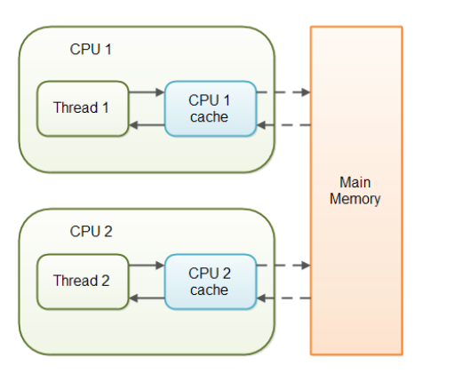

# Volatile

## Volatile 关键字详解

<!-- notecardId: 1735185952227 -->

### 基本概念

- Java 语言提供了一种稍弱的同步机制，即 volatile 变量，用来确保将变量的更新操作通知到其他线程。
- volatile 变量具备两种特性(可见性和有序性),volatile 变量不会被缓存在寄存器或者对其他处理器不可见的地方，因此在读取 volatile 类型的变量时总会返回最新写入的值。
- volatile 是 Java 提供的轻量级同步机制，它有以下特性：
  1. 保证可见性
  2. 禁止指令重排
  3. 不保证原子性
- 比 synchronized 更轻量级的同步锁
- 在访问 volatile 变量时不会执行加锁操作，因此也就不会使执行线程阻塞
- 适用于一个变量被多个线程共享，线程直接给这个变量赋值的情况
- 
  - 当对非 volatile 变量进行读写的时候，每个线程先从内存拷贝变量到 CPU 缓存中。如果计算机有多个 CPU，每个线程可能在不同的 CPU 上被处理，这意味着每个线程可以拷贝到不同的 CPU cache 中。
  - 声明变量是 volatile 的，JVM 保证了每次读变量都从内存中读，跳过 CPU cache 这一步。

### 工作机制

#### 内存可见性

- 当一个线程修改 volatile 变量时，该变量的值会立即被写回主内存
- 其他线程读取该变量时，会直接从主内存中读取最新值

#### 禁止指令重排

- volatile 会在前后加入内存屏障
- 保证 volatile 变量的读写操作不会被重排到其他指令之前或之后

### 适用场景

1. 状态标志：比如用于停止线程的标志位
2. 单例模式的双重检查锁定
3. 独立观察者模式下的状态同步

### 使用示例

```java
public class VolatileExample {
    private volatile boolean flag = false;

    public void setFlag() {
        flag = true; // 修改立即可见
    }

    public boolean getFlag() {
        return flag; // 获取最新值
    }
}
```

### 使用限制

- volatile 只能保证对变量的简单读写是原子的
  - 可以: boolean flag = true
  - 可以: long value = 123L
- 但不能保证复合操作是原子的
  - 不可以: i++ (因为是读取 i、计算 i+1、写回 i 这三步)
  - 不可以: count = count + 1

### 注意事项

1. volatile 不能保证复合操作的原子性
2. 适用于一写多读的场景
3. 需要原子性操作时应使用 synchronized 或 atomic 类
4. 适合一次性赋值
5. 状态标记
6. 独立的变量(不和其他变量关联)
