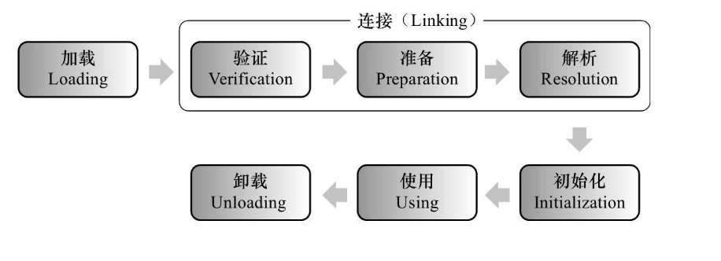

# Java 类加载机制

## Java 8 类加载机制

<!-- notecardId: 1735097417786 -->

Java 8 的类加载机制主要包括以下几个步骤：



### 1. 加载（Loading）

加载是指将类的字节码从不同的数据源（如文件系统、网络等）读取到内存中，并创建一个 `java.lang.Class` 对象。加载过程由类加载器（ClassLoader）完成。

### 2. 链接（Linking）

链接过程包括验证、准备和解析三个阶段：

- **验证（Verification）**：确保类的字节码符合 JVM 规范，保证不会危害 JVM 的安全。
- **准备（Preparation）**：为类的静态变量分配内存，并将其初始化为默认值。
- **解析（Resolution）**：将常量池中的符号引用替换为直接引用。

### 3. 初始化（Initialization）

初始化是指执行类构造器 `<clinit>` 方法的过程。该方法由编译器自动收集类中的所有静态变量的赋值动作和静态代码块中的语句合并产生。

### 类加载器（ClassLoader）

<!-- notecardId: 1735097417792 -->

Java 中的类加载器分为以下几种：

- **启动类加载器（Bootstrap ClassLoader）**：负责加载 Java 核心类库，如 `rt.jar`。
- **扩展类加载器（Extension ClassLoader）**：负责加载 `jre/lib/ext` 目录中的类库。
- **应用程序类加载器（Application ClassLoader）**：负责加载用户类路径（classpath）上的类库。

### 双亲委派模型

<!-- notecardId: 1735097417793 -->

Java 的类加载器采用双亲委派模型，即类加载器在加载类时，首先将请求委派给父类加载器，只有当父类加载器无法完成加载时，子类加载器才会尝试加载。这种机制保证了 Java 核心类库的安全性。

### 示例代码

<!-- notecardId: 1735097417794 -->

```java
public class ClassLoaderExample {
    public static void main(String[] args) {
        // 获取系统类加载器
        ClassLoader systemClassLoader = ClassLoader.getSystemClassLoader();
        System.out.println("System ClassLoader: " + systemClassLoader);

        // 获取扩展类加载器
        ClassLoader extClassLoader = systemClassLoader.getParent();
        System.out.println("Extension ClassLoader: " + extClassLoader);

        // 获取启动类加载器
        ClassLoader bootstrapClassLoader = extClassLoader.getParent();
        System.out.println("Bootstrap ClassLoader: " + bootstrapClassLoader);
    }
}
```

以上代码展示了如何获取不同的类加载器，并打印它们的信息。
