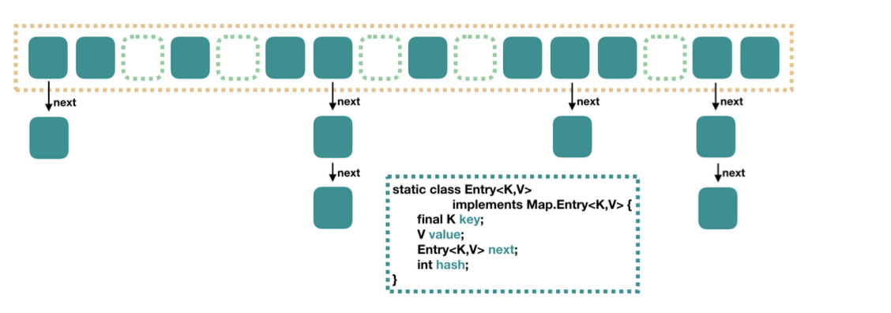
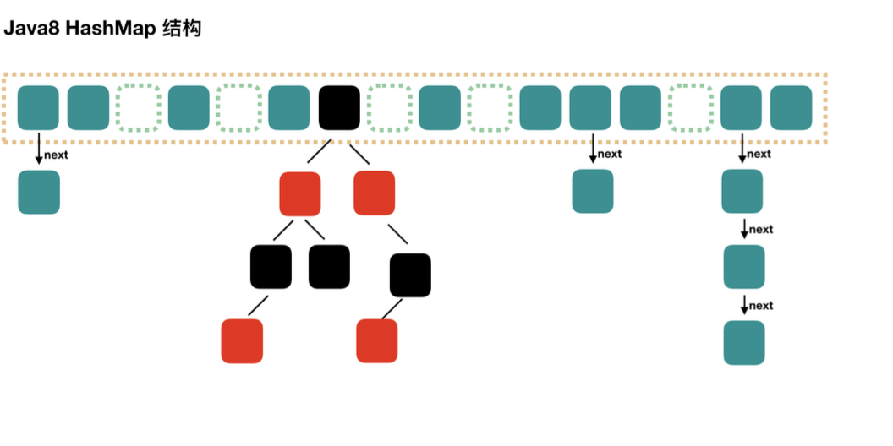

# Java 8 HashMap 实现详解

## JavaHashMap 概述

<!-- notecardId: 1735049283290 -->

### 说明

- HashMap 最多只允许一条记录的键为 null，允许多条记录的值为 null
- jdk7: 
- jdk8: 
  1. capacity：当前数组容量，始终保持 2^n，可以扩容，扩容后数组大小为当前的 2 倍。
  2. loadFactor：负载因子，默认为 0.75。
  3. threshold：扩容的阈值，等于 capacity \* loadFactor

### HashMap 底层数据结构

- HashMap 的底层数据结构主要由数组和链表/红黑树组成。每个数组元素是一个链表或红黑树的头节点，称为 `Node`。`Node` 的实现如下：

```java
static class Node<K,V> implements Map.Entry<K,V> {
    final int hash;
    final K key;
    V value;
    Node<K,V> next;

    Node(int hash, K key, V value, Node<K,V> next) {
        this.hash = hash;
        this.key = key;
        this.value = value;
        this.next = next;
    }

    public final K getKey()        { return key; }
    public final V getValue()      { return value; }
    public final String toString() { return key + "=" + value; }
    public final int hashCode()    { return Objects.hashCode(key) ^ Objects.hashCode(value); }
    public final V setValue(V newValue) {
        V oldValue = value;
        value = newValue;
        return oldValue;
    }
    public final boolean equals(Object o) {
        if (o == this)
            return true;
        if (o instanceof Map.Entry) {
            Map.Entry<?,?> e = (Map.Entry<?,?>)o;
            if (Objects.equals(key, e.getKey()) &&
                Objects.equals(value, e.getValue()))
                return true;
        }
        return false;
    }
}
```

- 当链表长度超过阈值（默认是 8）时，链表会转换为红黑树。红黑树的节点实现如下：

```java
static final class TreeNode<K,V> extends LinkedHashMap.Entry<K,V> {
    TreeNode<K,V> parent;  // red-black tree links
    TreeNode<K,V> left;
    TreeNode<K,V> right;
    TreeNode<K,V> prev;    // needed to unlink next upon deletion
    boolean red;

    TreeNode(int hash, K key, V val, Node<K,V> next) {
        super(hash, key, val, next);
    }

    // Additional methods for tree operations (e.g., rotate, balance, etc.)
}
```

通过这种结构，HashMap 能够在大多数情况下提供高效的插入、删除和查询操作。

### Java 8 HashMap 实现

Java 8 对 HashMap 进行了许多优化和改进，主要包括以下几个方面：

1. **数据结构**：Java 8 之前，HashMap 主要使用数组和链表来存储键值对。当发生哈希冲突时，冲突的键值对会被存储在链表中。Java 8 引入了红黑树，当链表长度超过一定阈值（默认是 8）时，链表会转换为红黑树，以提高查询效率。

2. **哈希函数**：Java 8 对哈希函数进行了优化，减少了哈希冲突的概率。通过对哈希值进行扰动处理，使得哈希值更加均匀地分布在数组中。

3. **扩容机制**：当 HashMap 中的元素数量超过数组容量的负载因子（默认是 0.75）时，HashMap 会进行扩容。扩容时，数组容量会翻倍，并重新计算每个元素的哈希值，将其放入新的数组中。

4. **查询效率**：Java 8 对查询效率进行了优化，通过红黑树来提高查询效率。当链表长度超过一定阈值时，链表会转换为红黑树，以提高查询效率。

### HashMap 常见操作

#### put 操作

`put` 方法用于将键值对插入到 HashMap 中。其执行过程如下：

1. **计算哈希值**：首先，根据键的 `hashCode` 计算哈希值，并通过扰动函数进一步处理哈希值，以确保哈希值的均匀分布。
2. **定位桶**：根据哈希值确定键值对在数组中的位置（即桶）。
3. **插入元素**：如果桶为空，则直接插入键值对。如果桶不为空，则遍历链表或红黑树，检查是否存在相同的键。如果存在相同的键，则更新对应的值；如果不存在相同的键，则将新的键值对插入到链表或红黑树中。
4. **检查是否需要转换为红黑树**：如果插入后链表长度超过阈值（默认是 8），则将链表转换为红黑树。
5. **检查是否需要扩容**：如果插入后 HashMap 的元素数量超过数组容量的负载因子（默认是 0.75），则进行扩容。

#### get 操作

`get` 方法用于根据键从 HashMap 中获取对应的值。其执行过程如下：

1. **计算哈希值**：根据键的 `hashCode` 计算哈希值，并通过扰动函数进一步处理哈希值。
2. **定位桶**：根据哈希值确定键值对在数组中的位置（即桶）。
3. **查找元素**：如果桶为空，则返回 `null`。如果桶不为空，则遍历链表或红黑树，查找与键匹配的节点。如果找到匹配的节点，则返回对应的值；如果未找到匹配的节点，则返回 `null`。

#### 扩容操作

当 HashMap 中的元素数量超过数组容量的负载因子（默认是 0.75）时，HashMap 会进行扩容。扩容操作的具体步骤如下：

1. **创建新数组**：首先，创建一个容量为原数组两倍的新数组。
2. **重新计算哈希值**：遍历原数组中的每个元素，重新计算每个元素的哈希值，以确定其在新数组中的位置。
3. **迁移元素**：将原数组中的元素迁移到新数组中。对于链表结构，需要重新构建链表；对于红黑树结构，需要重新构建红黑树。
4. **更新引用**：最后，将 HashMap 的数组引用指向新数组。

扩容操作会导致所有元素的哈希值重新计算，并重新分配位置，因此是一个相对耗时的操作。为了减少扩容操作的频率，可以在创建 HashMap 时指定初始容量和负载因子。

### HashMap 的哈希函数

在 Java 8 中，HashMap 对哈希函数进行了优化，通过扰动处理来减少哈希冲突的概率。具体来说，扰动处理是对哈希值进行额外的位运算，使得哈希值更加均匀地分布在数组中，从而提高查询效率。

以下是 Java 8 中 HashMap 的扰动函数实现：

```java
static final int hash(Object key) {
    int h;
    return (key == null) ? 0 : (h = key.hashCode()) ^ (h >>> 16);
}
```

该函数首先计算键的 `hashCode` 值，然后将其高 16 位与低 16 位进行异或运算。通过这种方式，扰动函数将高位的信息混合到低位，从而使得哈希值更加均匀地分布在数组中，减少了哈希冲突的概率。

这种扰动处理的主要目的是为了在哈希表的大小为 2 的幂次时，能够更好地利用哈希值的所有位，从而提高哈希表的性能。

### JDK 8 改进点

Java 8 对 HashMap 进行了多项改进，主要包括以下几个方面：

1. **引入红黑树**：当链表长度超过一定阈值（默认是 8）时，链表会转换为红黑树，以提高查询效率。红黑树的查询时间复杂度为 O(log n)，而链表的查询时间复杂度为 O(n)。

2. **优化哈希函数**：Java 8 对哈希函数进行了优化，减少了哈希冲突的概率。通过对哈希值进行扰动处理，使得哈希值更加均匀地分布在数组中。

3. **改进扩容机制**：当 HashMap 中的元素数量超过数组容量的负载因子（默认是 0.75）时，HashMap 会进行扩容。扩容时，数组容量会翻倍，并重新计算每个元素的哈希值，将其放入新的数组中。

4. **增强并发性能**：虽然 HashMap 本身不是线程安全的，但 Java 8 对 `ConcurrentHashMap` 进行了改进，引入了分段锁机制，提高了并发性能。

这些改进使得 Java 8 中的 HashMap 在性能和效率上都有了显著提升。

### 常见面试题

> Q1: Java 8 中 HashMap 的底层数据结构是什么？

**A1**: Java 8 中 HashMap 的底层数据结构是数组和链表/红黑树的结合体。当发生哈希冲突时，冲突的键值对会被存储在链表中。当链表长度超过一定阈值（默认是 8）时，链表会转换为红黑树。

> Q2: Java 8 中 HashMap 如何解决哈希冲突？

**A2**: Java 8 中 HashMap 通过链表和红黑树来解决哈希冲突。当发生哈希冲突时，冲突的键值对会被存储在链表中。当链表长度超过一定阈值（默认是 8）时，链表会转换为红黑树，以提高查询效率。

> Q3: Java 8 中 HashMap 的扩容机制是怎样的？

**A3**: 当 HashMap 中的元素数量超过数组容量的负载因子（默认是 0.75）时，HashMap 会进行扩容。扩容时，数组容量会翻倍，并重新计算每个元素的哈希值，将其放入新的数组中。

> Q4: 为什么 Java 8 中引入了红黑树？

**A4**: Java 8 中引入红黑树是为了提高查询效率。当链表长度超过一定阈值（默认是 8）时，链表会转换为红黑树。红黑树的查询时间复杂度为 O(log n)，而链表的查询时间复杂度为 O(n)，因此红黑树可以显著提高查询效率。

> Q5: HashMap 是线程安全的吗？

**A5**: HashMap 不是线程安全的。如果需要在多线程环境中使用 HashMap，可以使用 `Collections.synchronizedMap` 方法将 HashMap 包装成线程安全的，或者使用 `ConcurrentHashMap`。
