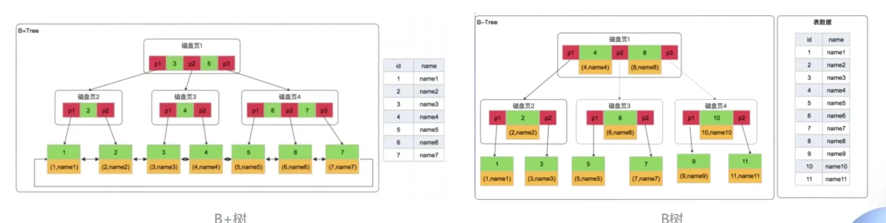

# mysql

## MySQL 为什么要使用 B+ 树作为默认索引的数据结构,而不是 B 树?

<!-- notecardId: 1735264820322 -->

### 说明

- B+ 树是一种平衡树，它的叶子节点通过链表相连，形成一个有序的链表，方便范围查询和顺序访问。而 B 树的叶子节点并不一定在同一层，范围查询时需要遍历多个节点，效率较低。
- B+ 树的非叶子节点只存储索引信息，节点的大小更小，可以在内存中缓存更多的节点，提高缓存命中率，进一步提升查询性能。
- B+ 树的插入和删除操作只影响叶子节点，不会影响非叶子节点的结构，操作更加稳定。而 B 树的插入和删除操作可能会导致树的重构，影响性能。
- B+ 树的叶子节点通过链表相连，方便范围查询和顺序访问，而 B 树的叶子节点并不一定在同一层，范围查询时需要遍历多个节点，效率较低。
  
- InnoDB 底层存储结构为 B+树， B+树的每个节点对应 innodb 的一个 page，page 大小是固定的，一般设为 16k。其中非叶子节点只有键值，叶子节点包含完成数据。

### 优点

- 数据放在叶子节点，可以腾出空间让分支节点可以组织更宽 的树一一提高数据检索性能
- 叶子节点双向链表，所有数据都维护在叶子节点一一对范围查询和排序性能更好

### MySQL 选择使用 B+ 树而不是 B 树，主要是因为 B+ 树在数据库系统中具有以下几个显著的优势

#### 1. 更高的磁盘读写效率

B+ 树的所有叶子节点都在同一层，并且通过链表相连，这使得范围查询和顺序访问更加高效。相比之下，B 树的叶子节点不一定在同一层，范围查询时需要遍历多个节点，效率较低。

### 2. 更高的查询性能

在 B+ 树中，所有的关键字都出现在叶子节点中，而非叶子节点只存储索引信息。这意味着每个节点可以存储更多的索引信息，从而减少树的高度，降低查询时的 I/O 次数，提高查询性能。

#### 3. 更好的缓存命中率

由于 B+ 树的非叶子节点只存储索引信息，节点的大小更小，可以在内存中缓存更多的节点，提高缓存命中率，进一步提升查询性能。

#### 4. 更适合范围查询

B+ 树的叶子节点通过链表相连，范围查询时只需遍历叶子节点即可，无需回溯，提高了范围查询的效率。而 B 树的范围查询需要在树中进行多次查找，效率较低。

#### 5. 更稳定的插入和删除性能

B+ 树的插入和删除操作只会影响叶子节点，不会影响非叶子节点的结构，操作更加稳定。而 B 树的插入和删除操作可能会导致树的重构，影响性能。

> 综上所述，B+ 树在磁盘读写效率、查询性能、缓存命中率、范围查询和插入删除性能等方面都优于 B 树，因此 MySQL 选择使用 B+ 树作为其索引结构。
