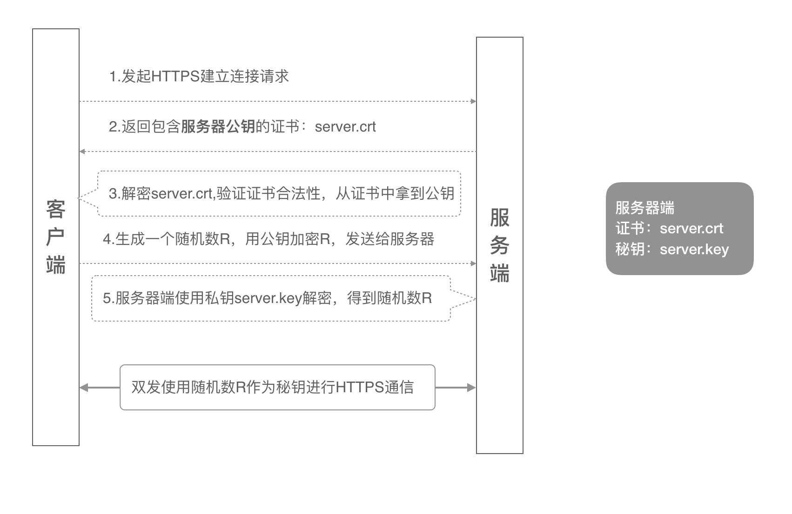
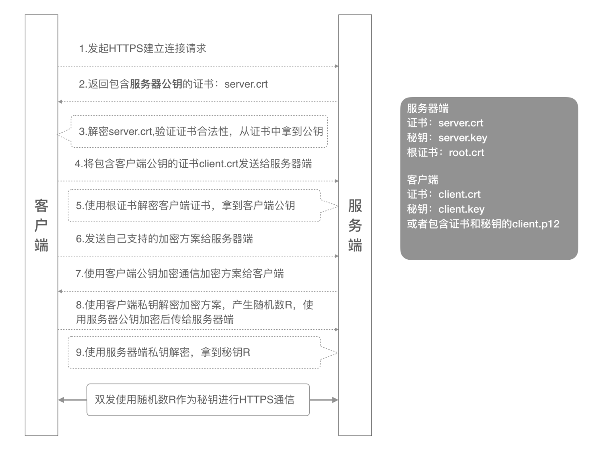

# TLS 相关概念

## TLS 简介

<!-- notecardId: 1735106236324 -->

传输层安全性（Transport Layer Security，TLS）是一种用于在两个通信应用程序之间提供保密性和数据完整性的协议。TLS 是 SSL（Secure Sockets Layer）的后继者，旨在确保互联网通信的安全。

### 单向 TLS

单向 TLS 是最常见的 TLS 配置。在这种配置中，只有服务器需要提供证书来证明其身份，而客户端则不需要提供证书。单向 TLS 的工作流程如下：

1. 客户端向服务器发起连接请求。
2. 服务器发送其证书给客户端。
3. 客户端验证服务器证书的有效性。
4. 如果证书有效，客户端生成一个对称密钥，并使用服务器的公钥加密该密钥，然后发送给服务器。
5. 服务器使用其私钥解密对称密钥。
6. 双方使用对称密钥进行加密通信。

### 双向 TLS

双向 TLS（也称为双向认证或双向 SSL）要求双方都提供和验证证书。这种配置通常用于需要更高安全性的场景，例如金融交易或敏感数据传输。双向 TLS 的工作流程如下：

1. 客户端向服务器发起连接请求。
2. 服务器发送其证书给客户端。
3. 客户端验证服务器证书的有效性。
4. 服务器请求客户端证书。
5. 客户端发送其证书给服务器。
6. 服务器验证客户端证书的有效性。
7. 如果双方证书都有效，客户端生成一个对称密钥，并使用服务器的公钥加密该密钥，然后发送给服务器。
8. 服务器使用其私钥解密对称密钥。
9. 双方使用对称密钥进行加密通信。

通过双向 TLS，双方都能确认对方的身份，从而提供更高的安全性。

